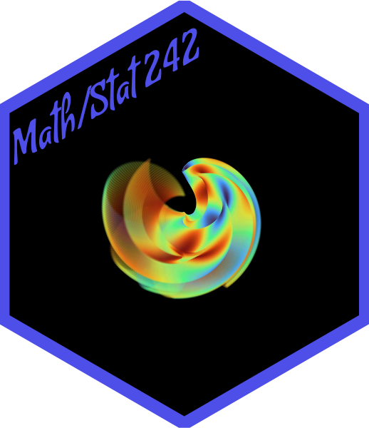

# Fall/Spring Semester Labs
Set of R labs for Math/Stat 242 at Pacific Lutheran University. 

**Package is currently under construction. All vignettes and templates are currently from [stat231](https://github.com/npaterno/Stat231). All will be updated or rewritten for this package.

The labs are meant to give a brief introduction to some of the many uses of *R* for statistical computing including data summaries, data visualization, inferential statistics - including simulation - and least squares regression. We also cover project based workflows and some basic computer navigation skills.

Each lesson is available as a vignette or a slidedeck posted on our [course site](https://npaterno.github.io/left_coast_stats/two_four_two.html); We'll go over how to get to the vignettes during our first lab session. 

Each assignment is available as an rmarkdown template. Once complete, you should knit your document and submit the resulting html (or pdf) file via email. 
